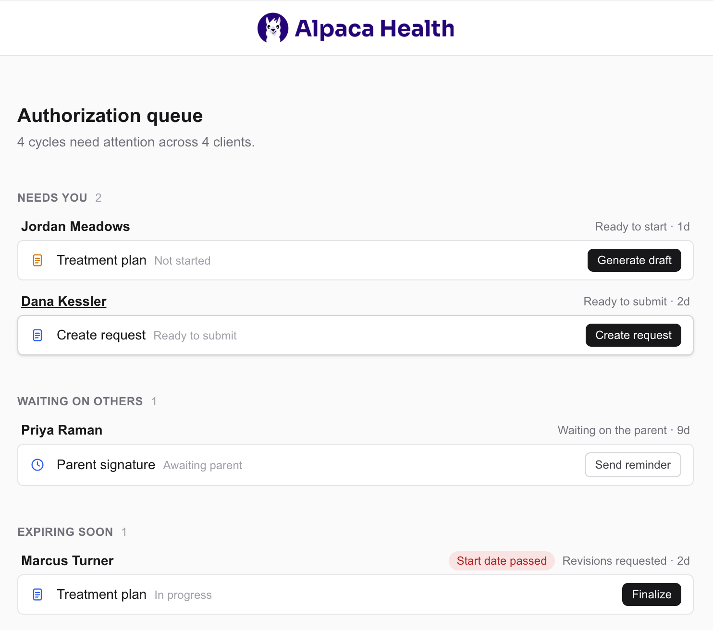
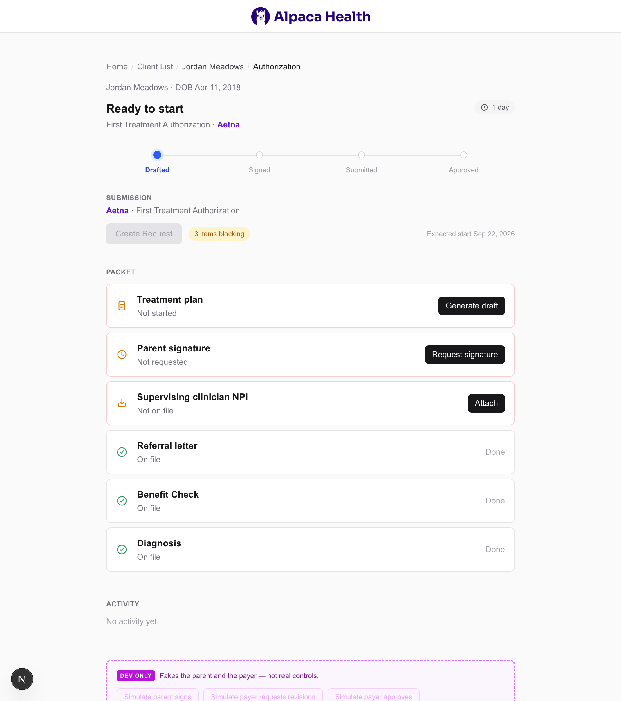

# Alpaca Health Take-Home: Authorization Redesign

## 🦙 [alpaca-health.netlify.app](https://alpaca-health.netlify.app/)

## The Problem

Clinicians work across two tabs to authorize treatment: **Treatment Plans** (where documents live) and **Care Readiness** (where checklists live). Neither is organized around what they're actually doing: **get one authorization approved.**

This creates five specific failures:

1. **You can't tell which plan is live.** Multiple uploads show the same `Care ready` badge.
2. **The progress stepper skips stages and can't move backward.** When a payer sends changes back, there's nowhere for the cycle to go.
3. **The summary contradicts the details.** Green `Ready` badges sit above red Xs saying `Diagnosis not uploaded`. Clinicians have to open everything anyway.
4. **Validation waits until submission.** Missing fields (like NPI) only appear when you try to submit, not while you're planning.
5. **Create Request lives on documents** but is really about the authorization cycle, so it feels disconnected from the flow.

**Root cause:** The authorization cycle, what clinicians actually work on, has no home in the UI. It exists in the data but not in the interface.

## How I Approached This

I hadn't worked in insurance before, so I spent time understanding the authorization cycle, payer requirements, and compliance constraints. Claude helped me think through what actually matters in the domain.

**My process:**

1. **Started with the UX question.** Asked "where do I start?" and sketched on paper what a clinician needs to see at a glance. This revealed the core problem: the authorization cycle has no visual home.

2. **Analyzed the current design.** Worked with Claude to understand the flow from the brief and screenshots, pulling out the five specific failures.

3. **Built the domain model first.** Created a spec documenting the problem, the state machine, the data model (ERD), and three seed clients at different points in the flow. This became the source of truth.

4. **Set clear constraints.** Documented rules in claude.md: no derived state as booleans, signature pinned to version, packet items typed by blocker.

5. **Broke the build into layers.** Rather than ask Claude for "build the whole app," I asked for one piece at a time: domain (state machine + walkthrough script), then components (packet row), then pages. Each layer could be tested independently.

6. **Built and tested.** Used Claude Code to generate the UI, tested everything at localhost:3000, fixed what didn't match the model.

**What I used Claude for:**

- Structuring the domain model and data flow
- Generating UI code (which I tested and trusted)
- Organizing the build plan so each piece verified independently

**Key insight:** Building the model first made the UI obvious. Once the state machine was solid, the interface almost designed itself.

## The Solution

**One Page, One Cycle**

The Authorization page replaces both tabs. It shows:

- A progress bar that can move backward (when revisions are needed)
- A packet of requirements, each with a type and status (`missing` / `in progress` / `done`)
- One action per row: `Generate`, `Finalize`, `Request signature`, `Edit goals`, `Resend`, `Attach`
- A submit button that's only enabled when there are no blockers

**How the model works:**

- A signature is pinned to a specific plan version. When version 2 is created, version 1's signature automatically becomes stale so no manual flag needed.
- Packet requirements come from a template (matched to payer + auth type), then resolved against what's already on file. What's missing or complete is calculated from the model, not stored separately.
- The cycle moves through phases. Everything else (blockers, next steps, signature staleness) is derived from that single source of truth.

**The Queue:**
Clinicians see open cycles grouped by what's blocking: `Needs you`, `Waiting on others`, `Expiring soon`. The same row component appears in both the queue (compact) and the Authorization page (full detail). Clicking a row navigates to that cycle.

## Screenshots

**Authorization Queue**
All cycles grouped by blockers. One place to see the whole caseload.

**Authorization Page: Ready to Start (Jordan)**
Three blockers (plan, signature, NPI). The progress bar is at `Drafted`. Submit button is disabled.

**Treatment Plan Drill-In (Marcus)**
Shows the payer's revision note, version history, and toolbar for edit, download, replace, audit, finalize.

**Generator Stub (Jordan)**
Six named sections with AI-generated badges. Fake latency, then `Review and finalize` dispatches the draft started event.

## What Was Built

**Domain Layer**

- Cycle state machine with backward movement (submitted → drafting when payer requests revisions)
- Packet requirements generated from templates and resolved against what's on file
- Three seed clients at different stages: Jordan (not started), Priya (signature stalled), Marcus (revisions requested)
- Walkthrough script proving the state machine works end-to-end

**UI**

- Packet row component (reused in both queue and Authorization page)
- Authorization page (header, progress bar, packet rows, submit section, activity log)
- Queue grouped by blockers
- Generator modal (fake latency, named sections, dispatches `draft started`)
- Dev strip with three buttons: simulate parent signs, simulate payer requests revisions, simulate payer approves
- Breadcrumb navigation (Home > Client List > Client Name)
- Fourth seed client (Dana K.) to test the happy path

**Tested end-to-end:**

- Dana: ready to submit → awaiting payer → approved (happy path)
- Marcus: draft → sign → submit → revisions → version 2 → sign → resubmit → approve (revision loop)
- Each client's page shows correct blocking count and status

## What Was Cut & Why

**Multi-Payer Support**
I modeled it (each payer gets its own cycle via cycleId → insuranceCardId). But I shipped single-payer because each Authorization page is scoped to one cycle. A real clinic with two payers would need a cycle switcher on the page.

**Benefit Checks Table**
These live in the Insurance tab. Clinicians could jump there if needed, but I didn't build that link for this prototype.

**Reauth**
That's when a client's auth expires and needs renewal six months later. The brief asked for "where do I start → submitted," which is one cycle. I demonstrated the backward edge with Marcus's revision instead.

**Full Modals**
Create Request and Generate Plan are stubbed. The buttons work and dispatch events, but the modals would just collect payer-specific form data. The clickable loop is real.

**Backend, Database, Auth**
Out of scope. State lives in memory; refresh loses it.

## How I Built It

1. **Domain first**: State machine, seed clients, walkthrough script, all verified before touching React
2. **One reusable component**: Packet row at two densities (queue compact, page full), used everywhere so they stay in sync
3. **Pages second**: Authorization page, then queue, then extras
4. **Interactivity last**: Dev strip buttons so you can click through the entire flow

## Open Questions

**Does a guardian signature survive a payer-requested revision?**
I assumed no. When the plan changes, the signature becomes stale. But minor revisions might keep the original signature valid in practice, which would add a clinician judgment call and complicate the state machine.

**Is there a targeted edit path for one goal?**
`Edit goals` currently means going through the entire 8-step generator. If that's the only door, there's friction. Unclear if there's a faster way to fix just one section.

**When does a benefit check expire?**
If a check runs stale between draft and submission, should that be a blocker? The model doesn't know when to flag it.

## Deployment

**Live:** [alpaca-health.netlify.app](https://alpaca-health.netlify.app/)

**Repo:** [github.com/victoriasiderea/alpacahealth](https://github.com/victoriasiderea/alpacahealth)

**Local:** `npm install && npm run dev` → localhost:3000

Visit the queue, click into each client, and use the dev strip to move them through the flow.
